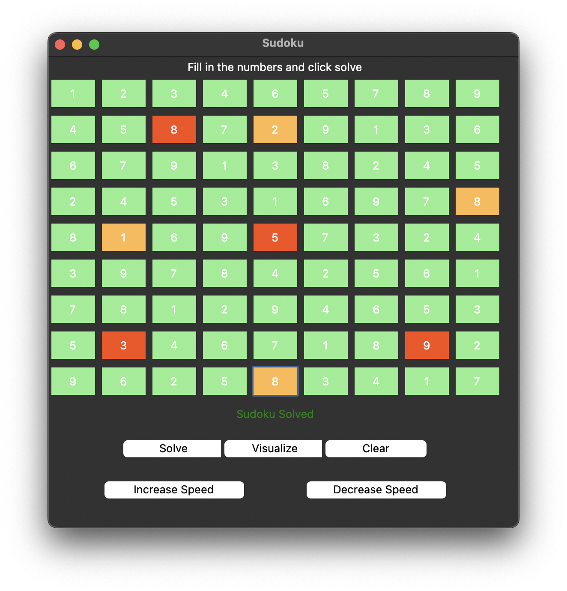

# CSP Sudoku Solver

## Introduction
This Python application provides a Sudoku solver using Constraint Satisfaction Problem (CSP) techniques. It includes a graphical user interface (GUI) implemented using Tkinter, allowing users to input Sudoku puzzles, visualize the solving process, and obtain solutions.

## Features
- **Graphical User Interface (GUI):** Simple and intuitive interface for interacting with the Sudoku solver.
- **Sudoku Solver:** Applies CSP techniques to solve Sudoku puzzles.
- **Visualizer:** Provides an option to visualize the solving process step by step.

## How to Use
1. **Clone the repository:** `git clone https://github.com/Abdo404Khaled/CSP_Sudoku_Solver.git`
2. **Run the application:** `python sudoku_solver.py`
3. **GUI Usage:**
   - Enter Sudoku numbers into the cells.
   - Click the "Solve" button to obtain the solution.
   - Click the "Visualize" button to visualize the solving process.
   - Adjust the solving speed using the "Increase Speed" and "Decrease Speed" buttons.
   - Click the "Clear" button to clear the board.

## Screenshots

## Algorithms Used
- **Backtracking Algorithm:** The primary algorithm for solving Sudoku puzzles.
- **Constraint Satisfaction Problem (CSP):** Applied to ensure that each number is placed considering the constraints of the puzzle.

## Speed Controls
- Use the "Increase Speed" and "Decrease Speed" buttons to adjust the speed of the visualizer.

## Contributors
- Abdelrahman Khaled

Feel free to contribute, report issues, or suggest improvements!
